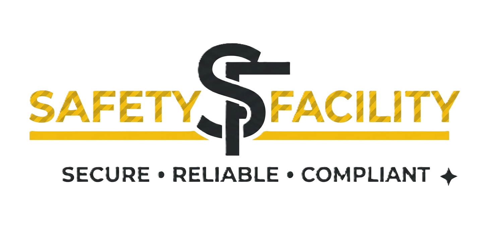

<p align="center">
  
</p>

<h1 align="center">Sistem Pengecekan Fasilitas Keselamatan</h1>

<p align="center">
  Aplikasi web untuk <b>monitoring, pengecekan, dan pelaporan</b> fasilitas keselamatan berbasis <b>QR Code</b> — agar inspeksi APAR, lampu darurat, P3K, dan eyewash lebih cepat, efisien, dan terdokumentasi.
</p>

<p align="center">
  
  
  
  
  
</p>

---

## 📌 Tentang Project

**Sistem Pengecekan Fasilitas Keselamatan** membantu tim HSE (Health, Safety & Environment) memastikan setiap perangkat keselamatan — **APAR, lampu emergency, lampu exit, P3K, dan eyewash** — berada dalam kondisi prima melalui inspeksi berkala yang terdigitalisasi.

Project ini merupakan hasil **migrasi dari aplikasi PHP Native lama ke arsitektur modern**: frontend React + TypeScript (Vite & Tailwind CSS 4) yang berkomunikasi dengan REST API berbasis PHP melalui JSON.

### Fitur Utama

| Fitur | Keterangan |
|-------|------------|
| 🔍 **QR Code Scanner** | Akses & input data pengecekan perangkat dengan memindai QR Code pada label. |
| 📋 **Manajemen Master Data** | Kelola master lampu (emergency/exit), P3K, eyewash, dan area/line. |
| ✅ **Pengecekan Rutin** | Input hasil inspeksi berkala dengan status layak/tidak layak. |
| 📅 **Agenda Inspeksi** | Jadwalkan dan pantau agenda pengecekan agar selalu tepat waktu. |
| 📊 **Visualisasi Data** | Grafik interaktif di dashboard untuk analisis kondisi fasilitas. |
| 📄 **Laporan Digital** | Rekap laporan & ekspor Excel per kategori fasilitas. |
| 🏷️ **Cetak Barcode** | Cetak label barcode/QR per perangkat maupun massal. |
| 🔔 **Notifikasi Otomatis** | Pengingat untuk pengecekan dan perawatan. |
| 🔐 **Manajemen User** | Login terstruktur dengan peran admin, termasuk akses login darurat. |

---

## 🧱 Arsitektur

```
safety_facility/
├── api/                    # REST API (PHP)
│   ├── config.php          # CORS, koneksi DB, helper (api_action, api_response, dll.)
│   ├── auth.php            # Login / logout / sesi
│   ├── dashboard.php       # Statistik dashboard
│   ├── scan.php            # QR scan & input pengecekan
│   ├── master_lampu.php    # CRUD master lampu
│   ├── master_p3k.php      # CRUD master P3K
│   ├── master_eyewash.php  # CRUD master eyewash
│   ├── area_line.php       # Area / line
│   ├── agenda.php          # Agenda inspeksi
│   ├── data_inspeksi.php   # Data hasil pengecekan
│   ├── laporan.php         # Laporan
│   ├── export_excel.php    # Ekspor laporan ke Excel
│   ├── export_master.php   # Ekspor master ke Excel
│   └── cetak_barcode*.php  # Cetak label barcode (satuan/massal)
│
├── frontend/               # Frontend React (Vite + TypeScript + Tailwind)
│   ├── src/
│   │   ├── pages/          # Landing, Login, Login Darurat, Lupa Password
│   │   ├── admin/          # AdminLayout + Dashboard, Scan, Master, Agenda, Laporan, dll.
│   │   ├── api/client.ts   # HTTP client (axios)
│   │   ├── styles/admin.css# Styling halaman admin (responsive)
│   │   └── App.tsx         # Routing (react-router)
│   ├── public/             # Font Poppins, logo, foto, template barcode
│   └── dist/               # Hasil build (di-serve production)
│
├── Database/
│   └── safety_facility.sql # Skema & data database
└── .gitignore
```

### Halaman (Routes)

- **Publik:** `/` (landing), `/login`, `/login-darurat`, `/lupa-password`
- **Admin:** `/admin` (dashboard), `/admin/scan`, `/admin/master-lampu`, `/admin/lampu-exit`, `/admin/master-p3k`, `/admin/master-eyewash`, `/admin/area-line/:jenis`, `/admin/agenda`, `/admin/laporan/:type`, `/admin/data-inspeksi/:type`

### Database

Tabel utama: `users`, `departemen`, `area_line`, `master_lampu`, `master_p3k`, `master_eyewash`, `inspeksi_lampu`, `inspeksi_lampu_exit`, `inspeksi_p3k`, `inspeksi_eyewash`, `agenda_inspeksi`.

---

## 🚀 Cara Menjalankan

### Prasyarat
- XAMPP / Apache + PHP 8+ (dengan mod_rewrite)
- MySQL
- Node.js 18+

### 1. Setup Database
1. Buka `phpMyAdmin` → buat database `safety_facility`.
2. Import `Database/safety_facility.sql`.

### 2. Konfigurasi API
Buat file `.env` di root (atau set environment variable) sesuai koneksi DB Anda:

```env
DB_HOST=localhost
DB_USER=root
DB_PASS=
DB_NAME=safety_facility
```

Jika kosong, default yang dipakai: `localhost` / `root` / (tanpa password) / `safety_facility`.

### 3. Build Frontend

```bash
cd frontend
npm install
npm run build
```

Hasil build tersimpan di `frontend/dist/`.

### 4. Development (opsional)

```bash
cd frontend
npm run dev
```

Vite dev server akan me-proxy `/api` ke `http://localhost/safety_facility` (lihat `vite.config.ts`).

### 5. Akses Aplikasi

Buka `http://localhost/safety_facility/` — akan otomatis redirect ke frontend yang sudah di-build.

> **Catatan:** `.htaccess` diarahkan untuk subfolder `/safety_facility/`. Jika ditempatkan di folder lain, sesuaikan `RewriteBase` dan `base` di `vite.config.ts`.

---

## 🧪 Endpoint API (contoh)

Semua endpoint di `api/` menerima parameter `action` (via GET `?action=` atau body JSON/POST) dan mengembalikan JSON.

```bash
# Login
POST /safety_facility/api/auth.php
{ "action": "login", "username": "...", "password": "..." }

# Daftar master lampu
POST /safety_facility/api/master_lampu.php
{ "action": "list" }
```

**Respon standar:**
```json
{ "success": true, "data": [...] }
```

---

## 🛠️ Teknologi

- **Frontend:** React 19, TypeScript, Vite 6, Tailwind CSS 4, React Router 7, Axios, Font Poppins.
- **Backend:** PHP 8 (REST API, JSON), MySQLi.
- **Keamanan:** Sesuai `config.php` — validasi sesi (`require_login()`) dan header CORS terkontrol.

---

## 📄 Lisensi

© 2026 Sistem Pengecekan Fasilitas Keselamatan. All rights reserved.
